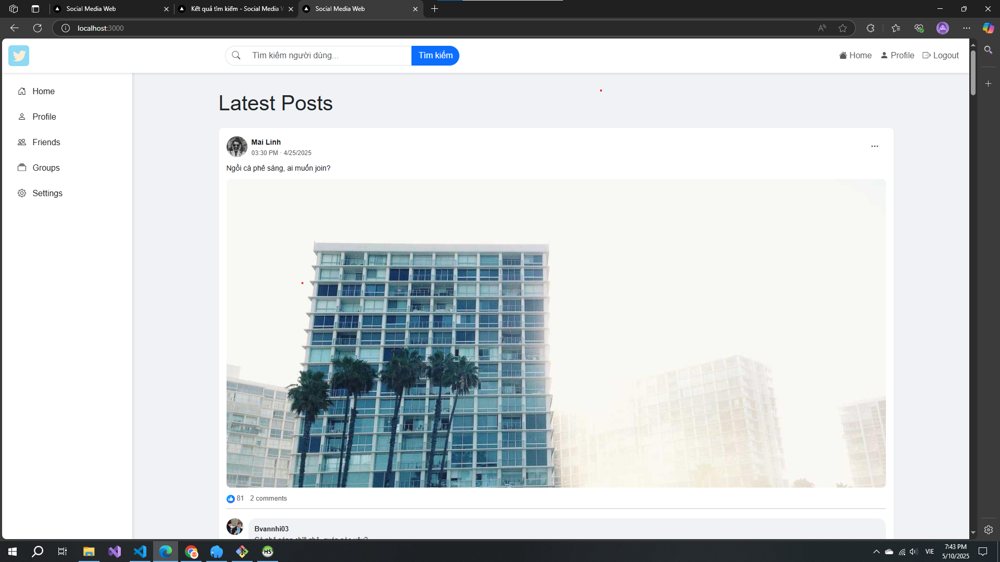
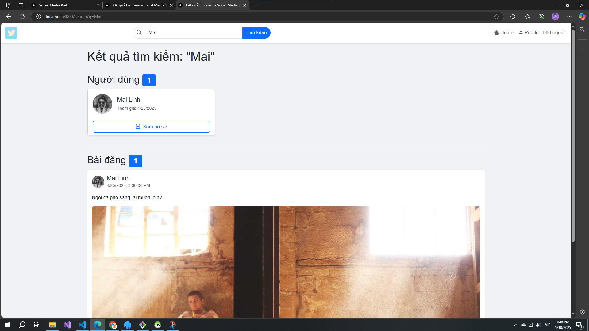
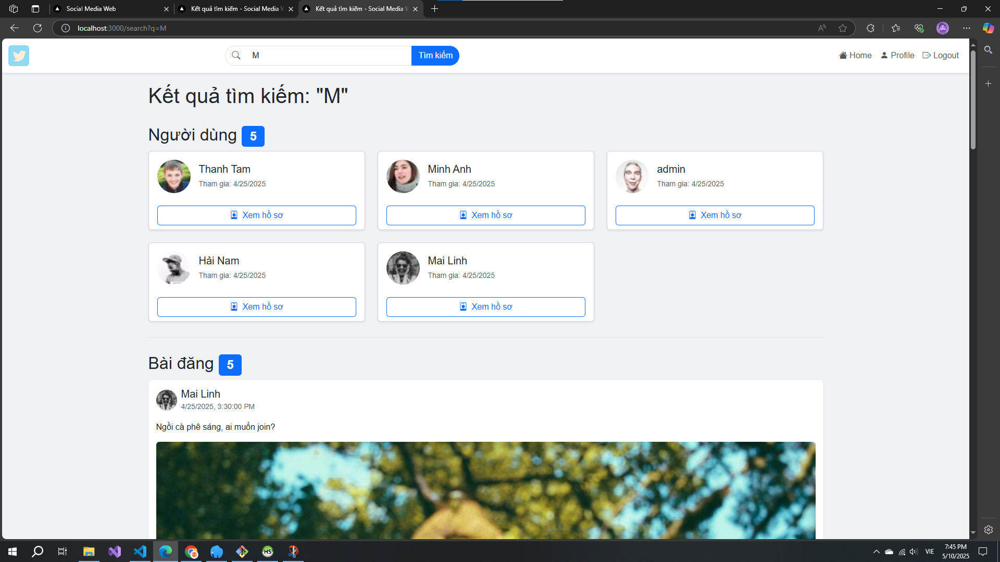

# Express Demo Project

## Project Overview

This is a demonstration project built with Express.js.

## Screenshots

### Home Page


### Search chi tiết

### Search nhiều người


## Getting Started

### Prerequisites
- Node.js (version 14 or higher)
- npm or yarn

### Clone the Repository

```bash
# Clone with HTTPS
git clone https://github.com/Vuong1411/express-demo.git

# Navigate to project directory
cd express-demo
```

### Installation

```bash
# Install dependencies
npm install

# Start the development server
npm start
```

Your application should now be running on [http://localhost:3000](http://localhost:3000)

## Project Structure

```
/social-media-web-demo
   ├── /config         # Database and app configuration
   ├── /models         # Data models
   │   ├── User.js     # User model
   │   ├── Post.js     # Post model
   │   └── Comment.js  # Comment model
   ├── /public         # Static assets
   │   ├── /css
   │   ├── /js
   │   └── /images
   ├── /routes         # Route handlers
   ├── /views          # EJS templates
   │   ├── index.ejs   # Home page
   │   ├── search.ejs  # Search results
   │   ├── login.ejs   # Login page
   │   └── profile.ejs # User profile page
   ├── app.js          # Application entry point
   └── README.md
```

## License

This project is licensed under the MIT License - see the [LICENSE](LICENSE) file for details.